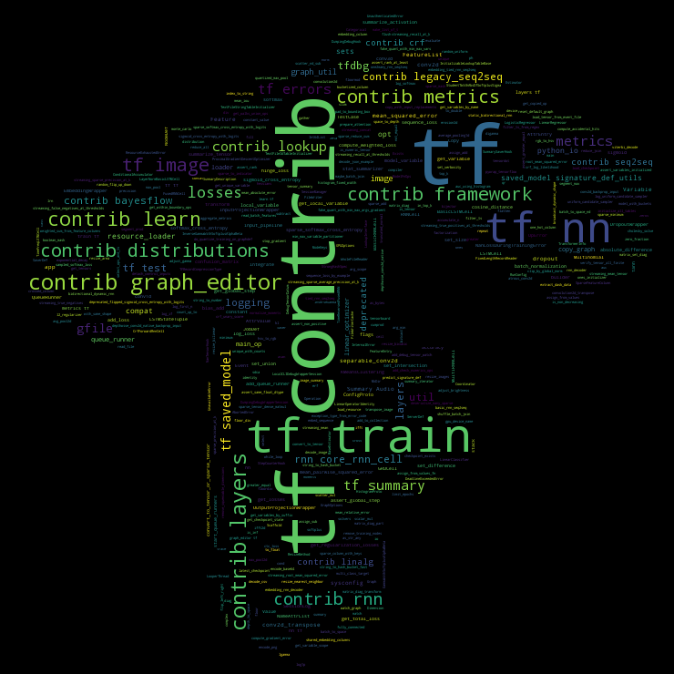

#  TensoRu

Документация TensorFlow с небольшими примерами для обучения:

Constant+Value+Tensors.ipynb - работа с константами
Random+Tensors.ipynb - инициализация рандомных значений
Sequences.ipynb - генерация последовательностей

Graph+into.ipynb - введение в работу с графами

Tf-cloud.png - просто word cloud с маской в виде tf)

Лицензия - DWYW (Do what you want)

